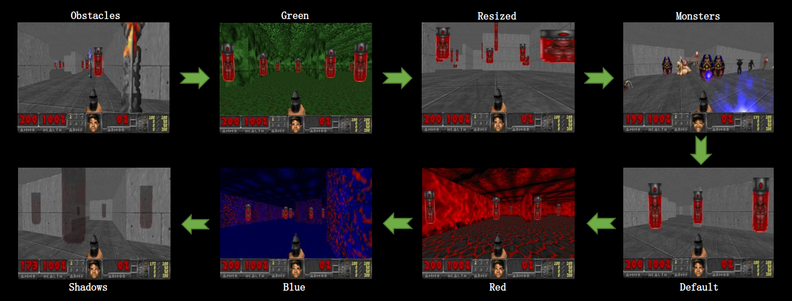
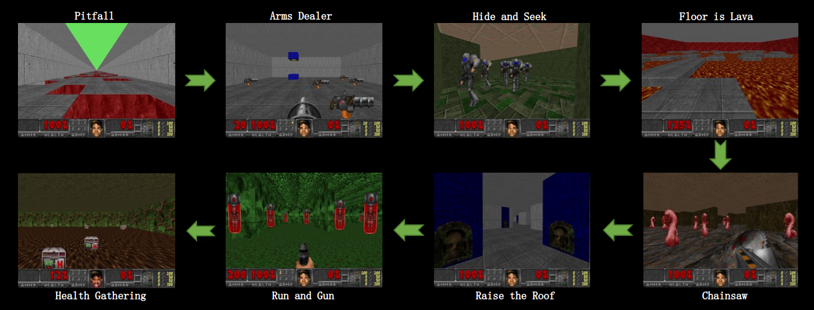

# COOM

COOM is a Continual Learning benchmark for embodied pixel-based RL, consisting of multiple task sequences in visually 
distinct 3D environments with diverse objectives. It is based on the [ViZDoom](https://github.com/mwydmuch/ViZDoom) platform.
A demo of COOM can be found on [Youtube](https://www.youtube.com/watch?v=FUm2B8MZ6d0&list=PL6nJZHA3y2fxQK73jmuI5teM3n6Mydcf7).

[//]: # (The core of our benchmark is CW20 sequence, in which 20 tasks are run, each with budget of 1M steps.)

[//]: # (We provide the complete source code for the benchmark together with the tested algorithms implementations and code for producing result tables and plots.)

## Installation
1. Install the dependencies for [ViZDoom](https://github.com/Farama-Foundation/ViZDoom/).
2. Clone the repository
```bash
$ git clone https://github.com/TTomilin/COOM
```
3. Navigate into the repository
```bash
$ cd COOM
```
4. Install the dependencies 
```bash 
$ python setup.py install
```

## Environments
The benchmark consists of 8 scenarios:

| Scenario         | Success Metric    | Enemies | Weapon  | Items   | Max Steps | Execute | Stochasticity                              | 
|------------------|-------------------|---------|---------|---------|-----------|---------|--------------------------------------------|    
| Pitfall          | Distance Covered  | &cross; | &cross; | &cross; | 1000      | JUMP    | Pitfall tile locations                     | 
| Arms Dealer      | Weapons Delivered | &cross; | &check; | &check; | 1000      | SPEED   | Weapon spawn locations, delivery locations | 
| Hide and Seek    | Frames Alive      | &check; | &cross; | &check; | 2500      | SPEED   | Enemy behaviour, item spawn locations      | 
| Floor is Lava    | Frames Alive      | &cross; | &cross; | &cross; | 2500      | SPEED   | Platform locations                         | 
| Chainsaw         | Kill Count        | &check; | &check; | &cross; | 2500      | ATTACK  | Enemy and agent spawn locations            | 
| Raise the Roof   | Frames Alive      | &cross; | &cross; | &cross; | 2500      | USE     | Agent spawn location                       | 
| Run and Gun      | Kill Count        | &check; | &check; | &cross; | 2500      | ATTACK  | Enemy and agent spawn locations            | 
| Health Gathering | Frames Alive      | &cross; | &cross; | &check; | 2500      | SPEED   | Health kit spawn locations                 | 


## Task Sequences for CL
There are two lengths of Continual Learning task sequences in our benchmark: the primary 8 task sequence, and a shorter 
4 task version, which is comprised of the 2<sup>nd</sup> half of the original one. The task sequences are further 
distinguished by the altering type: cross-domain and cross-objective. 

### Cross-Domain
In the cross-domain setting, the agent is sequentially trained on modified versions of the same ViZDoom scenario. 
`Run and Gun` is selected as basis for this CL sequence, since out of the 8 scenarios in the benchmark, it best resembles 
the actual Doom game, requiring the agent to navigate the map and eliminate enemies by firing a weapon. The objective and
the layout of the map remain the same across tasks, whereas we modify the environment in the following ways: 
1) Changing the textures of the surrounding walls, ceiling and floor 
2) Varying the size, shape and type of enemies 
3) Randomizing the view height of the agent, and 
4) Adding objects to the environment which act as obstacles, blocking the agent’s movement.

#### Depiction of the tasks in the CD8 sequence in order

### Cross-Objective
Cross-objective task sequences employ a different scenario with a novel objective for each consecutive task, apart from 
only changing the visuals and dynamics of a single scenario. This presents a diverse challenge, as the goal might 
drastically change from locating and eliminating enemies (`Run and Gun` and `Chainsaw`) to running away and hiding 
from them (`Hide and Seek`). In a similar fashion, the scenario `Floor is Lava` often requires the agent to remain at a 
bounded location for optimal performance, whereas scenarios `Pitfall`, `Arms Dealer`, `Raise the Roof`, and `Health 
Gathering` endorse constant movement.
#### Depiction of the tasks in the CO8 sequence in order


# Running

## Basic Usage
```
from coom.envs import ContinualLearningEnv
from coom.utils.enums import Sequence

cl_env = ContinualLearningEnv(Sequence.CO8)
for env in cl_env.tasks:
    env.reset()
    done = False
    while not done:
        action = env.action_space.sample()
        state, reward, done, truncated, info = env.step(action)
        env.render()
        if done:
            break
    env.close()
```

You can run single task or continual learning experiments with `run_single.py` and `run_cl.py` scripts, respectively.

To see available script arguments, run with `--help` option, e.g. `python3 run_single.py --help`

### Single task

#### Quick start  
`python3 run_single.py --scenario pitfall`

#### Training examples  
`python3 run_single.py --scenario health_gathering --envs obstacles --test_envs lava slime --seed 0 --steps 2e5 --log_every 250`

### Continual learning

#### Quick start  
`python run_cl.py --sequence CO4 --cl_method packnet`

#### Training examples
```
python run_cl.py --sequence CD4 --cl_method packnet --packnet_retrain_steps 10000 --clipnorm 2e-05
python run_cl.py --sequence CO8 --cl_method agem --regularize_critic True --episodic_mem_per_task 10000 --episodic_batch_size 128
python run_cl.py --sequence COC --batch_size 512 --buffer_type reservoir --reset_buffer_on_task_change False --replay_size 2e5
```

## Results

### Average Performance
The performance (success rate) averaged over tasks is a typical metric for the CL setting. The agent is continually
evaluated on each of the tasks in the sequence even before it has been trained on it.


### Forward Transfer
The COOM benchmark can also be used to evaluate forward transfer, which enables faster learning and/or better final 
performance owing to already learned tasks. We compare the training performance each  CL method with a SAC baseline, 
which is trained directly on the same from scratch without any CL-specific modifications. The red areas between the 
curves represent negative forward transfer and other colors represent positive forward transfer. We depict the results
of forward transfer for the CO8 sequence, which is the most challenging one in the benchmark.


## Reproducing results

### Running experiments
The scripts for running all our experiments in the paper can be found [here](https://github.com/TTomilin/COOM/tree/main/experiments/scripts).

### Downloading results
We recommend using [Weights | Biases](https://wandb.ai/) to log your experiments. 
Having done so, [download,py](https://github.com/TTomilin/COOM/tree/main/experiments/results/download.py) can be used to download results:  
`python download.py --project <PROJECT> --sequence <SEQUENCE> --metric <METRIC>`  
The relevant metrics used in the paper are: `success` and `kills`.

### Plotting results

Figures from the paper can be drawn using the [plotting scripts](https://github.com/TTomilin/COOM/tree/main/experiments/results).  
`python plot_results_envs.py --sequence <SEQUENCE> --metric <METRIC>`  
`python plot_results_methods.py --sequence <SEQUENCE> --metric <METRIC>`

### Calculating metrics
All the numeric results displayed in the paper can be calculated using [cl_metrics.py](https://github.com/TTomilin/COOM/tree/main/experiments/results/cl_metrics.py).  
`python cl_metrics.py --sequence <SEQUENCE> --metric <METRIC>`


# Acknowledgements

COOM heavily relies on [ViZDoom](https://github.com/mwydmuch/ViZDoom).  
The `run_and_gun` scenario and its environment modification were inspired by [LevDoom](https://github.com/TTomilin/LevDoom).  
The implementation of Discrete SAC used in our code comes from [Tianshou](https://github.com/thu-ml/tianshou).  
Our experiments were managed using [WandB](https://wandb.ai).  
